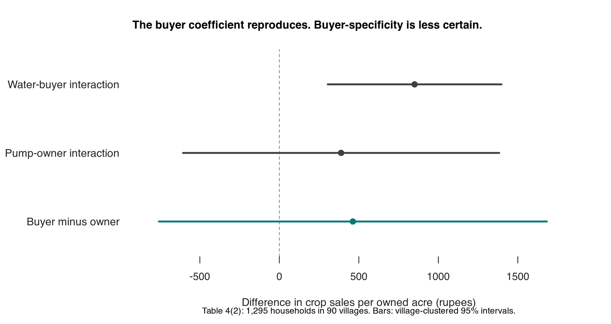

```{r setup, include=FALSE}
knitr::opts_chunk$set(echo = FALSE)
ols <- read.csv("output/ols_tables.csv")
iv <- read.csv("output/iv_table.csv")
wild <- read.csv("output/wild_bootstrap.csv")
contrast <- read.csv("output/water_contrasts.csv")
boot <- read.csv("output/iv_pairs_bootstrap.csv")
comparison <- read.csv("output/published_regression_comparison.csv")
num <- function(x, digits = 1) formatC(x, format = "f", digits = digits, big.mark = ",")
entry <- function(model, term, column, table = ols) {
  value <- table[table$model == model & table$term == term, column]
  stopifnot(length(value) == 1L, is.finite(value))
  value
}
```

# Well, Actually

A replication and review of Siwan Anderson’s
[“Caste as an Impediment to Trade”](https://www.aeaweb.org/articles?id=10.1257/app.3.1.239)
(AEJ: Applied Economics, 2011). Groundwater, caste, and a second look at the evidence.

The main coefficients reproduce. All `r nrow(comparison)` displayed coefficient/standard-error
pairs checked agree within 0.1 rupee. The water-buyer interaction survives removing any one
village. The stronger claim is less secure: the data measure crop sales rather than physical
yields, three of four direct irrigation differences lose significance when clustered by village, and the
data do not establish that buyers benefit differently from pump owners. The instrumental-variable
result is sensitive to inference: the full-procedure village bootstrap gives a percentile interval
of −₹395 to ₹8,982 and a studentized interval of ₹1,529 to ₹10,447. Both are wide;
one includes zero and the other does not.



The points are the village-dominance interactions for water buyers and pump owners in Table 4(2),
and their difference. All use the same 1,295 households and village-clustered 95% t intervals.
A significant buyer interaction and an insignificant owner interaction do not establish a
difference between them: the direct test has p = `r num(contrast$p[3], 3)`.

The argument and all twelve review checks are in [the review](ms/review.md).
The [village balance and historical-data audit](ms/water-balance.md) shows what the
existing comparisons rule out, which 1991 SHRUG variables are available, and why the
missing survey-to-Census crosswalk prevents historical checks.

| Check | Result | Evidence |
|---|---:|---|
| Baseline village-dominance coefficient | ₹`r num(entry("T3_1", "domlow", "estimate"))` (SE `r num(entry("T3_1", "domlow", "se"))`) | [Reproduction](output/published_regression_comparison.csv) |
| Water-buyer interaction | ₹`r num(entry("T4_2", "dlbuywater", "estimate"))` (SE `r num(entry("T4_2", "dlbuywater", "se"))`) | [OLS tables](output/ols_tables.csv) |
| Buyer minus owner interactions | ₹`r num(contrast$estimate[3])` (SE `r num(contrast$se[3])`), p = `r num(contrast$p[3], 3)` | [Direct contrasts](output/water_contrasts.csv) |
| District-adjusted village coefficient, wild bootstrap | p = `r num(wild$p_wild[wild$model == "T3_2"], 3)` | [Wild bootstrap](output/wild_bootstrap.csv) |
| IV interaction, published inference | ₹`r num(entry("T5_IV", "dlbuywater", "estimate", iv))` (SE `r num(entry("T5_IV", "dlbuywater", "se", iv))`) | [IV table](output/iv_table.csv) |
| IV interaction, village pairs bootstrap | 95% percentile interval [₹`r num(boot$percentile_lower[boot$term == "dlbuywater"], 0)`, ₹`r num(boot$percentile_upper[boot$term == "dlbuywater"], 0)`] | [Full-procedure bootstrap](output/iv_pairs_bootstrap.csv) |
| Three published sample sizes | 1,295 printed; 1,127, 1,122, and 1,127 used | [Sample comparison](output/published_sample_comparison.csv) |

These are reproduction and sensitivity results from the original sample, not an independent
new-data replication. The IV percentile interval is not a weak-instrument-robust confidence set.
Anderson reports that lower-caste water buyers have **45% higher agricultural yields** in
villages where lower castes own most of the land than in villages dominated by upper castes.
But the measured outcome is **money from crops sold per acre owned**. Higher sales could reflect
more production, different crops or prices, or selling more of the harvest instead of consuming it.
The regressions reproduce a positive crop-sales gap; they do not directly measure a 45% increase
in physical crop yields. The supplied code also does not show how the rupee estimates become 45%.
The [magnitude comparison](ms/magnitude-benchmarks.md) checks the claim against Kerala
fishing markets, groundwater contracting, and canal irrigation, keeping the different outcomes
and comparison groups explicit. It also audits what we know about the dominance cutoff.

Attributing the gap to caste barriers requires another step: establishing that other differences
between the villages do not explain it. The buyer–seller pairs, water prices, and delivery records
needed to investigate the proposed trading mechanism are absent from this dataset.

The economic question is why profitable alternatives do not emerge. Nearby sellers, new wells,
or shared irrigation could compete away some of the gap. Distance, installation costs, and unreliable
contracts could prevent that, but the data do not show which obstacle binds or whether caste causes it.
The [economics section of the review](ms/review.md) works through these possibilities and the evidence
needed to distinguish them.

The baseline uses **1,295 households in 90 villages**: 591 households in 48 high-caste-dominated
villages and 704 in 42 lower-caste-dominated villages. Village samples range from 1 to 32 households,
with a median of 13. Equal total weight per village gives a baseline difference of ₹586 per owned
acre, compared with ₹567 under the original household weighting. This is a sensitivity check;
it does not recover the original survey weights.

Following the checks discussed by Lal, Lockhart, Xu, and Zu, I compared IV and OLS on the same
1,127 households in 80 villages and bootstrapped the complete estimation procedure.
The IV interaction is 3.85 times the OLS interaction, but their difference is imprecisely estimated.
The two bootstrap intervals disagree about whether zero is excluded. See the
[IV results](output/iv_lal_bootstrap_summary.csv) and [explanation](ms/review.md).

Run from the repository root:

```sh
make deps
make run
make test
make lint
```

`make deps` restores `renv.lock` into `.R/library`; the other targets use that library when
present. R 4.6.0 was used for the recorded run. `make run` reproduces all six tables, performs the
robustness checks, and regenerates the figure and this README from the results. It downloads the final paper if needed, requires Poppler’s `pdftotext`, and takes several minutes. The prose review is a written interpretation of
the recorded analysis. [REPRODUCING.md](REPRODUCING.md) documents inference conventions, seeds,
dependencies, and the tests.

| Directory | Contents |
|---|---|
| `data/original/` | Unmodified Stata files, original commands, readme, and license |
| `src/` | R reproduction, sensitivity analyses, published comparisons, and figure |
| `tests/` | Independent matrix-algebra checks, Stata benchmark, and data invariants |
| `output/` | Machine-readable estimates, intervals, sample counts, and bootstrap draws |
| `ms/` | Review and the twelve-check coverage matrix |
| `sources/` | Provenance and locally cached paper and independent Stata log |

The original [AEA replication archive](https://www.openicpsr.org/openicpsr/project/113777/version/V1/view)
is distributed under the terms in [its license](data/original/LICENSE.txt).
The [author’s final paper](https://drive.google.com/file/d/1GGvPbS3WOeyfbWfTIU2SI3_4DKJqL8Op/view)
and [independent 2022 Stata reproduction](https://osf.io/h2u96/) provide the comparison sources.
See [sources/README.md](sources/README.md) for cached-file provenance.

[Research and writing opportunities arising from the review](ms/research-opportunities.md).

[Village-classification sensitivity](ms/dominance-sensitivity.md) checks every single-village reassignment.
[Independent replication feasibility](ms/land-records-plan.md) describes the IHDS and NSS surveys and Bihar land records already available locally.
[Agy audit and our adjudication](ms/independent-audit.md).
