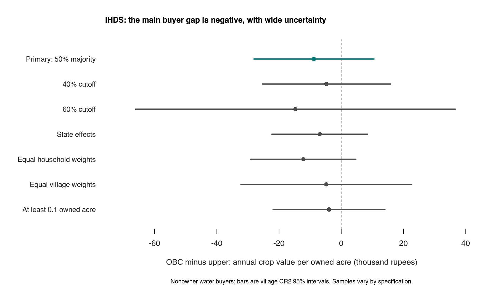

# Another draw from the well: the IHDS replication

```{r setup, include=FALSE}
knitr::opts_chunk$set(echo = FALSE)
knitr::opts_knit$set(root.dir = normalizePath(".."))
```

```{r values, include=FALSE}
estimates <- read.csv("output/ihds_replication_estimates.csv")
ratios <- read.csv("output/ihds_ratio_bootstrap_summary.csv")
metrics <- read.csv("output/ihds_measurement_metrics.csv")
flow <- read.csv("output/ihds_sample_flow.csv")
cells <- read.csv("output/ihds_primary_support.csv")
influence <- read.csv("output/ihds_leave_village_out.csv")
wild <- read.csv("output/ihds_wild_bootstrap.csv")
roster <- read.csv("output/ihds_roster_composition.csv")
reasons <- read.csv("output/ihds_classification_reasons.csv")
denominators <- read.csv("output/ihds_denominator_summary.csv")
get_estimate <- function(scenario, contrast = "buyer_gap") {
  estimates[estimates$scenario == scenario & !is.na(estimates$contrast) & estimates$contrast == contrast, ]
}
metric <- function(name) metrics$value[metrics$metric == name]
rupees <- function(x) format(round(x), big.mark = ",", trim = TRUE, scientific = FALSE)
percentage <- function(x) sprintf("%.0f", 100 * x)
interval <- function(row) paste0("₹", rupees(row$lower), " to ₹", rupees(row$upper))
primary <- get_estimate("primary")
difference <- get_estimate("primary", "buyer_minus_owner")
ratio <- ratios[ratios$contrast == "buyer_gap", ]
```

**The main IHDS estimate does not reproduce Anderson's positive water-buyer association. Its uncertainty does not decisively rule out a large positive difference, and changing the land denominator changes the direction.** This is a later-survey test of a related crop-value outcome, not an exact replication of her cash-sales outcome or a causal estimate of caste discrimination.

Among nonowner water buyers, the estimated crop-value difference is **₹`r rupees(abs(primary$estimate))` lower per owned acre per year** in OBC-majority villages. The 95% interval runs from **₹`r rupees(abs(primary$lower))` lower to ₹`r rupees(primary$upper)` higher**. The comparison includes `r primary$n` Hindu OBC/SC farming households in `r primary$villages` villages, with four separate water statuses. The regression uses household survey weights, district effects, household size, education and an SC indicator. Uncertainty allows households within a village to move together and accounts for the small amount of information supporting each contrast.

The weighted observed mean among upper-village nonowner buyers is ₹`r rupees(primary$reference_mean)` per owned acre. The fitted difference is about **`r percentage(-primary$descriptive_ratio)`% lower** relative to that mean. A separate bootstrap that resamples whole villages and recalculates both the regression and the mean gives a relative interval of **`r percentage(-ratio$lower)`% lower to `r percentage(ratio$upper)`% higher** (`r ratio$valid` of `r ratio$draws` draws identified). **That interval includes a 45% advantage.** The rupee and relative intervals use different inference procedures; the relative interval also reflects uncertainty in the denominator. Neither establishes that caste causes the observed gap.

## Why OBC, and what about SC?

Anderson describes the lower-caste landowners as backward agricultural castes, mainly Yadavs (p. 242). Broad OBC ownership is the closest available IHDS category, but it also includes groups outside that description. The primary comparison therefore uses villages where reported land shares establish an OBC-Hindu majority versus an upper-caste-Hindu majority. It does not classify every village lacking an upper majority as OBC dominated.

Before household restrictions there are `r reasons$villages[reasons$reason == "obc_majority" & !is.na(reasons$reason)]` OBC-majority and `r reasons$villages[reasons$reason == "upper_majority" & !is.na(reasons$reason)]` upper-majority villages. Only **`r reasons$villages[reasons$reason == "sc_majority" & !is.na(reasons$reason)]` villages establish an SC majority**. SC-dominance comparisons are retained as insufficient-support entries, including the planned alternative cutoffs. They cannot establish a general SC-village effect.

OBC households and SC households are also estimated separately within the OBC-versus-upper comparison. An SC farmer in an OBC-dominated village is not necessarily buying from their own caste. Broad categories cannot identify a buyer and seller's actual jati or relationship.

## Who reports caste land ownership?

Anderson used the existing 1997–98 World Bank UP–Bihar survey. Its village questionnaire has one caste-ranking table. The downloaded questionnaire and metadata do not give us the number of people answering that table, separate answers by respondent, or a disagreement-resolution rule. The 15 or 30 sampled households per village described in the sampling documentation are household interviews, not verified independent answers to the village caste-ranking question. The prepared replication files omit the raw caste-by-caste rankings and their construction into the final dominance label.

A rank reveals who is ahead, not by how much. It cannot distinguish a narrow plurality from a large majority or let us move an ownership cutoff. This is an unresolved measurement and construction issue, not a demonstrated rate of misclassification. [Original survey follow-up](raw-survey-followup.md).

IHDS asks for agricultural land percentages for jatis listed because of their population size. It may omit a small-population or absentee landowning group. We leave unassigned shares unresolved rather than rescale the listed shares to 100. For the primary contrast, `r reasons$villages[reasons$reason == "unresolved_bounds" & !is.na(reasons$reason)]` of 195 villages remain unresolved and `r sum(reasons$villages[reasons$reason %in% c("neither_majority", "sc_majority")])` are outside the two majority categories. This selects a narrower population than all rural UP–Bihar villages.

The IHDS roster records **`r metric("roster_min")`–`r metric("roster_max")` participants per village, median `r metric("roster_median")`**. There is still only one collective set of land shares; those counts do not measure agreement. Representation varies:

```{r roster}
roster_table <- roster[, c(
  "exposure", "villages", "participants_median", "no_upper_hindu", "no_obc_hindu", "no_sc_hindu"
)]
roster_labels <- c(
  obc = "OBC majority", upper = "Upper majority", other_or_unresolved = "Other or unresolved"
)
roster_table$exposure <- roster_labels[roster_table$exposure]
names(roster_table) <- c(
  "Village category", "Villages", "Median participants", "No upper-Hindu participant",
  "No OBC-Hindu participant", "No SC-Hindu participant"
)
knitr::kable(roster_table, row.names = FALSE)
```

These are recorded participants, not a random sample of opinions. Lack of a group's participant creates a question about representation; it does not by itself prove the land estimate is wrong.

## The economic interpretation depends on the denominator

The released `FM22RSHH` aggregate is crop value/income. The IHDS guide lists it separately from crop residues and farm expenses; the questionnaire asks about production and prices. We have not recovered its crop-level construction or an equivalent cash-sales total. `INCCROP` is a separate measure after expenses. Neither outcome is physical crop yield.

Owned acreage is the maximum reported across three seasons, with all seasons observed and converted from local units. Cultivated crop-season acreage sums cultivation across seasons, including operated land that may be leased in. These denominators measure different things. On the identical complete sample:

```{r same_sample}
same_scenarios <- c("common_sample_gross", "common_sample_cultivated", "common_sample_net")
same_sample <- estimates[
  estimates$scenario %in% same_scenarios & !is.na(estimates$contrast) & estimates$contrast == "buyer_gap",
]
same_sample <- same_sample[match(same_scenarios, same_sample$scenario), ]
same_sample$measure <- c(
  common_sample_gross = "Crop value per owned acre",
  common_sample_cultivated = "Crop value per cultivated crop-season acre",
  common_sample_net = "Crop income after expenses per owned acre"
)[same_sample$scenario]
knitr::kable(data.frame(
  Outcome = same_sample$measure, Households = same_sample$n,
  `OBC minus upper (₹)` = rupees(same_sample$estimate),
  `95% interval (₹)` = paste(rupees(same_sample$lower), rupees(same_sample$upper), sep = " to "),
  check.names = FALSE
), row.names = FALSE)
```

The sign reversal between the first two outcomes persists with the same households. Upper-village buyers report more cultivated crop-season acreage relative to owned acreage: weighted mean ratios are `r sprintf("%.2f", denominators$crop_to_owned[denominators$dominance == 0])` versus `r sprintf("%.2f", denominators$crop_to_owned[denominators$dominance == 1])`. Repeated cultivation and leasing can change annual income per owned acre without an equivalent difference in output per crop-season acre. The ratio of household averages is not the average of household ratios; the saved calculations use the latter where appropriate.

If irrigation access enables an extra crop season, that can be a real economic benefit even without higher physical yield for a given crop. But the benefit must be measured against additional water, labor, seed, rent and other costs. Leasing or cropping intensity could also reflect pre-existing village differences rather than an effect of caste. Changing the denominator changes the question; automatically controlling these channels away would not identify the total effect. The IHDS reversal does not establish that these channels explain Anderson’s original 45% figure.

Anderson's proposed mechanism is that caste ties improve enforcement of water contracts. To explain a large gain through that mechanism, one would want evidence of buyer–seller caste relationships, water delivery, prices and quantities. Agricultural specialization, land use, crop choice and irrigation investment offer rival explanations for a village gap. Existing geography and commercial opportunities could also affect who buys water and who owns a pump. These survey comparisons cannot separate all those paths. [Composition diagnostics](../output/ihds_composition.csv).

## Sensitivity and actual statistical support

```{r sensitivity}
selected <- c(
  "primary", "cutoff_40", "cutoff_60", "state_effects", "equal_households", "equal_villages",
  "not_upper_majority", "broad_lower_majority", "single_jati_majority", "obc_households", "sc_households",
  "minimum_tenth_acre", "winsorized_99"
)
rows <- do.call(rbind, lapply(selected, get_estimate))
row_labels <- c(
  "Primary: 50% majority", "40% cutoff", "60% cutoff", "State effects", "Equal household weights",
  "Equal village weights", "No upper majority vs upper majority", "Combined lower-caste majority",
  "Single listed jati majority", "OBC households", "SC households", "At least 0.1 owned acre", "Top 1% capped"
)
knitr::kable(data.frame(
  Specification = row_labels, Households = rows$n, Villages = rows$villages,
  `Buyer gap (₹/owned acre)` = rupees(rows$estimate),
  `95% interval` = paste(rupees(rows$lower), rupees(rows$upper), sep = " to "), check.names = FALSE
), row.names = FALSE)
```



No one-village omission changes the primary buyer gap to positive: the range is **₹`r rupees(abs(min(influence$buyer_gap, na.rm = TRUE)))` lower to ₹`r rupees(abs(max(influence$buyer_gap, na.rm = TRUE)))` lower**. This establishes limited influence robustness, not causality or reliable village classification.

The primary sample has `r primary$upper_villages` upper-majority and `r primary$lower_villages` OBC-majority villages. Only `r metric("districts_with_both_groups")` of `r metric("primary_districts")` districts contain both categories, and `r metric("overlap_districts_one_upper_village")` of those have one upper village. The owner comparison has only `r cells$n[cells$dominance == 0 & cells$water_status == "owner"]` nonbuying owners in `r cells$villages[cells$dominance == 0 & cells$water_status == "owner"]` upper villages. The CR2 degrees of freedom are `r sprintf("%.1f", primary$df)` for the buyer gap and `r sprintf("%.1f", difference$df)` for buyer-gap minus owner-gap. Eighty-seven villages therefore do not supply 87 equally informative comparisons.

The buyer gap is **₹`r rupees(abs(difference$estimate))` lower than the owner gap**, with a difference interval of **`r interval(difference)`**. There is no precise evidence here that buyers have the larger positive village gap. Null-imposed wild village bootstrap checks give p-values `r sprintf("%.2f", wild$p_value[wild$contrast == "buyer_gap"])` and `r sprintf("%.2f", wild$p_value[wild$contrast == "buyer_minus_owner"])`; primary-family Holm corrections are also saved. These checks cannot remedy sparse owner cells. The HC1 comparison also flags a household with leverage essentially one because of its sparse district cell; it is a diagnostic, not our chosen inference method. The WCR31 implementation uses a verified square-root-weighted OLS representation of the same WLS model. It uses generalized inverses in `r wild$pseudo_inverse_warnings[1]` cluster-deletion calculations where nuisance columns lose rank; all corresponding leave-one-village-out primary buyer contrasts remain identified. WCR31 test-inversion intervals are unavailable in this R implementation, so the main reported intervals remain CR2. [Inference ladder](../output/ihds_inference_ladder.csv), [bootstrap diagnostics](../output/ihds_wild_bootstrap.csv).

The Bihar-only model has no upper-majority nonbuying owners. Its buyer gap can be estimated with very wide uncertainty; its owner gap and buyer-minus-owner contrast are explicitly unidentifiable. We test each requested contrast rather than let software's omitted-column choice supply a number.

## What was completed

The [committed pre-analysis plan](https://github.com/in-rolls/well-actually/blob/759955e4b3c987fd4cedeb6e64d18c7574bb68b3/ms/ihds-replication-plan.md) was committed before the first outcome fit, with pre-fit amendments for SC comparisons and the independent audit's support concerns. Data dictionaries, joins, code/label recodes, missingness, village representation and input hashes are saved. An independent reader also reproduced the main point estimates by direct weighted matrix algebra and verified the denominator reversal on the common sample. Unit tests cover unknown land shares, missing pump ownership, unit conversion, estimable versus unsupported contrasts, and weighted bootstrap equivalence.

Post-fit implementation repair: Bihar exposed a rank-deficient nuisance parameterization. The initial program withheld all its contrasts. We replaced that guard with a row-space estimability test, recovering only the identified contrasts; main-sample estimates did not change. The same repair retains an additional identified buyer contrast in the paired bootstrap. The bootstrap-interface adjustment preserves the planned estimator and WCR31 test rather than replacing survey weights.

These findings apply to the selected, classifiable majority villages and the later survey's related outcomes. No original-survey raw rank data, historical SHRUG placebo, physical-yield reconstruction, or causal IV replication was completed. SC dominance lacks enough villages. Other Indian states remain a separate future geographic extension.

Run `make ihds-replication` with the local `../land/data/ihds2/ICPSR_36151` archive available, or set `LAND_REPO`. Run `make test lint` for local validation. [All estimates](../output/ihds_replication_estimates.csv), [sample flow](../output/ihds_sample_flow.csv), [cell support](../output/ihds_replication_cells.csv), [scenario definitions](../output/ihds_scenario_definitions.csv).
